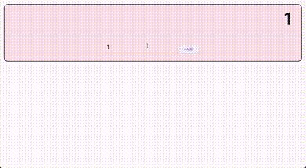

<!--
This README describes the package. If you publish this package to pub.dev,
this README's contents appear on the landing page for your package.

For information about how to write a good package README, see the guide for
[writing package pages](https://dart.dev/guides/libraries/writing-package-pages).

For general information about developing packages, see the Dart guide for
[creating packages](https://dart.dev/guides/libraries/create-library-packages)
and the Flutter guide for
[developing packages and plugins](https://flutter.dev/developing-packages).
-->

A library for managing state and communicating across dynamic forms and widget trees.

## Features

Widgets can pass events to other interstate widgets in the tree.

Widgets can query state from widgets below them in the tree.

Dynamically added widgets are automatically connected to the interstate.

Build dynamic forms without mirroring the structure in your data model. 

Widgets in your form can manage their own states and children, without a higher level state object to define structures.




## Getting started

### 1. Depend on it

Add this to your package's `pubspec.yaml` file:

```yaml
dependencies:
    interstate: '^1.0.0'
```


#### 2. Install it

You can install packages from the command line:

```bash
$ pub get
..
```

Alternatively, your editor might support pub. Check the docs for your editor to learn more.

#### 3. Import it

Now in your Dart code, you can use:

```Dart
import 'package:interstate/adjustable_positioned.dart';
```

## Usage

```dart
...
var handleSize = 24.0;
Stack(
    children: [
        Positioned(...),
        AdjustablePositionedWidget<Object>(
            startX: 48,
            startY: 64,
            startW: 128,
            startH: 128,
            minW: 64,
            minH: 64,
            activeAdjustmentCallback: (rect) { /** Do something */ },
            finishedAdjustmentCallback: (rect) { /** Do something else */ },
            handleWidgetBuilder: (context, handleId) => const Icon(Icons.circle),
            handleSize: handleSize,
            dragData: null,
            child: Padding(
                padding: EdgeInsets.all(handleSize),
                child: Container(color: Colors.red,),
            ),
        ),
    ....
    ]);
...
```

## Additional information

https://github.com/jdrotos/interstate
